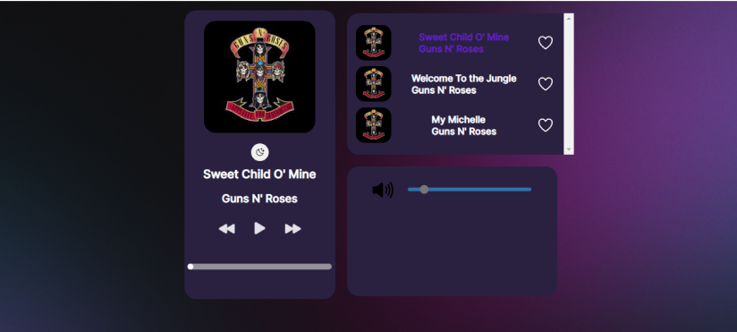

<h3 align="center"> Player de Música Funcional

 

 

## Proposta

 

Um player de música funcional que possui músicas pré definidas da banda Guns N' Roses, tendo um modo claro e escuro, também com controle de audio seletores de músicas.

## Músicas utilizadas

<a href=""><b><h3> Sweet Child O' Mine</h3>

Link</a>

 

<a href=""><h3><b>
Welcome To the Jungle</h3></b>

Link

</a>

<a href="">

<h3><b>My Michelle
</h3></b>

 

Link

</a>

## Futuras Atualizações

<ul>

<li>Mais Músicas a serem implementadas no projeto</li>
 

<li> Um modo de vídeo onde o usuário poderá visualizar o videoclipe oficial da música que será reproduzida</li>

</ul>